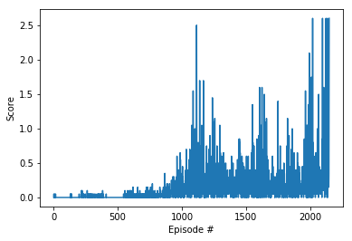
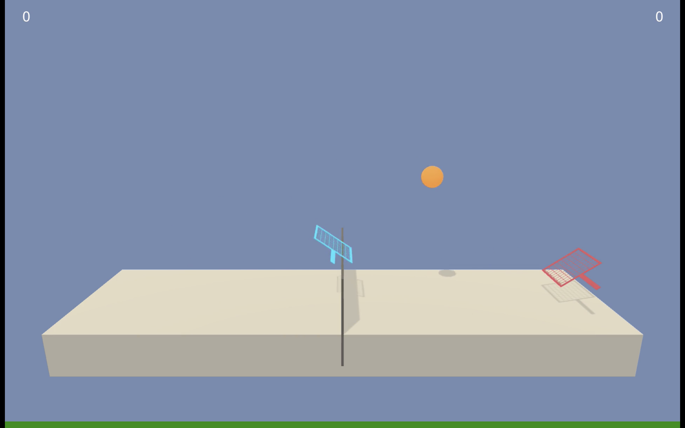

# Project 3: Tennis: Report

### 1. Introduction

For the third project of the Udacity Deep Reinforcement Learning Class, the goal was to solve a multi-agent environment.

The environment that needs to be solved consists of a "tennis" environment. In this environment, there are two agents playing tennis against each other. The reward structure of the environment is setup such that each time an agent gets the ball over the net, it receives a reward of +0.1. Conversely, each time the agents lets the ball hit the ground or hits it out of bounds, it receives a reward of -0.01. The environment is considered "solved" if the average reward over the previous 100 episodes is atleast +0.5.

### 2. Deep Deterministic Policy Gradient (DDPG)
DDPG is a policy-based method which tries to directly find the optimal policy without first trying to find the optimal action-value function. Furthermore, DDPG is able to deal with a continuous action-space. At some level, DDPG is closer to Deep Q-Learning than being a action-critic method, with a major improvement over Deep Q-Learning being that it can deal with a continuous action-space.

The DDPG learning method is setup as follows: 
DDPG uses two neural networks
- An "actor neural network" determines the best action for any given state.
- A "critic neural network" evaluates the optimal action-value function by using the actors best believed action.

DDPG reuses some of the strategies that were used with Deep Q-Learning. Two of the more important ones are the following:
1. Experience replay
2. Fixed Q-targets

In the case of experience replay, the agent generates an experience pool, and randomly samples from it to use for the learning. As the agent learns, the experience pool gets updated, and the agent continues randomly sampling from it.

DDPG does not really use Fixed Q-targets (as it does not calculate Q-values like Deep Q-Learning does), but the same idea is used. With DDPG, the algorithm keeps two copies of weights for both the actor and the critic network. These copies are called the regular network and the target network. The regular network is the most up-to-date network that is used for training, whereas the target network is used to stabilize the learning process. The target network on the other hand is used to calculate the losses by which the updates are made to the regular network.

For the regular and target networks, DDPG adds what is called "soft updates" over the update process used in Deep Q-Learning. In Deep Q-Learning, it was setup in such a way that every C steps the regular network overwrites the target network to get a new target network. With soft updates, instead of making an update every C steps, the target network is updated at every step by mixing in 0.01% of the regular weights into the weight of the target network. This has been proven to lead to faster convergence.

### 3. Neural network architecture and hyperparameters
Both the actor and critic neural networks had the same basic structure. The architecture of those are listed below.

For the training, initially a learning rate of 1e-4 was used for both the actor and the critic. It was observed that this learning rate seemed to be too slow. With this learning rate, even after several thousand episodes, the average rewards would not reach +0.5. In fact, the average reward would often reach an average of about +0.4, but then they would go all the way down to about +0.2, and then stay within this range, never reaching close to +0.5. After observing this phenomena, it was tried to slightly increasing the learning rates for both the actor and critic to 1e-3. With these new learning rates, the average reward of +0.5 was obtained in 2049 episodes.

The input to the neural network was the current state of the agent, which had a dimension of 33. The neural network had 3 layers, which each layer being fully connected. The details of the layers are as follows:
- Layer 1: Fully connected - 24 dimension input, 256 dimension output, Relu activation function
- Layer 2: Fully connected - 256 dimension input, 128 dimension output, Relu activation function
- Layer 3: Fully connected - 128 dimension input, 2 dimension output

For the output layer, in the case of the actor neural network, a tanh activation function was used. In the case of the critic neural network, an element-wise mean squared error loss was used to make the updates to the weights of the network.

Apart from this, the hyperparameters that were used were as follows:
- Buffer size: 10,000
- Batch size: 128
- Discouting factor: 0.99
- Actor Learning rate: 1e-3
- Critic Learning rate: 1e-3
- Maximum number of episodes: 20000
- Tau: 1e-3 - Tau is the parameter used for the soft-updates

### 4. Results
With the hyperparameters listed in the previous section, it took 2049 episodes for the environment to be "solved". The table below provides the results of the learning.

### 5. Discussion of results
The video that is linked below shows two agents running in the tennis environment using a checkpoint obtained after the environment was "solved". As can be seen in the video, the two agents did a very good job of keeping the ball in play. In the run shown, the agents aobtained an average reward of 1.245, which is a very good score.  

### 6. Proposed Improvements
As DDPG has origins from DQN, it is theorized that the techniques that are proven to improve DQN should also lead to improvements for DDPG. Specifically, the "rainbow" techniques can be used, which consist of the following six modifications:
1. Double DQN
2. Prioritized experience replay
3. Dueling DQN
4. Learning from multi-step bootstrap targets
5. Distrobutional DQN
6. Noisy DQN

In addition, other actor-critic methods such as A2C and A3C should also be tried to compare the performance with DDPG.

### 7. Conclusion
I was able to successfully "solve" the tennis environment using Deep Deterministic Policy Gradient. The training took 2049 episodes to complete, and a trained agent running in the environment was able to obtain a reward of 1.245. For future work, the "rainbow" techniques have been proposed, along with other actor-critic methods such as A2C and A3C to see how their performances compare with the performances of DDPG.

### 8. References
Please note that the code used originates from the DDPG code that was provided in the Udacity Deep Reinforcement Learning class, and then modifcations were done to make it applicable for the specific environment that was solved. Similarly, some of the content of the README file originates from the Udacity Deep Reinforcement Learning class, as well as from my submission for the first and second projects of this class.